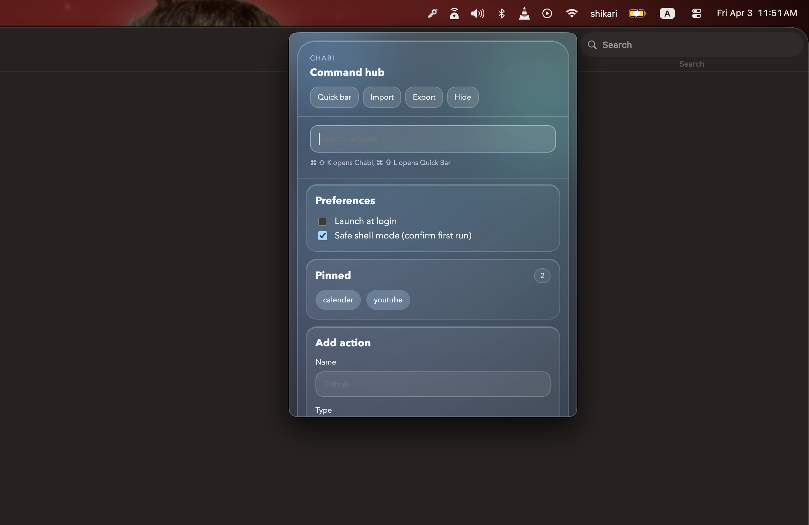
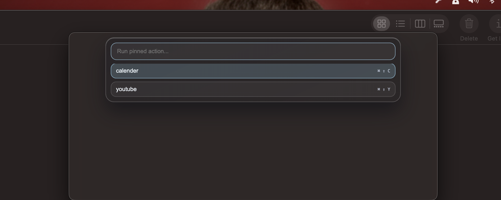
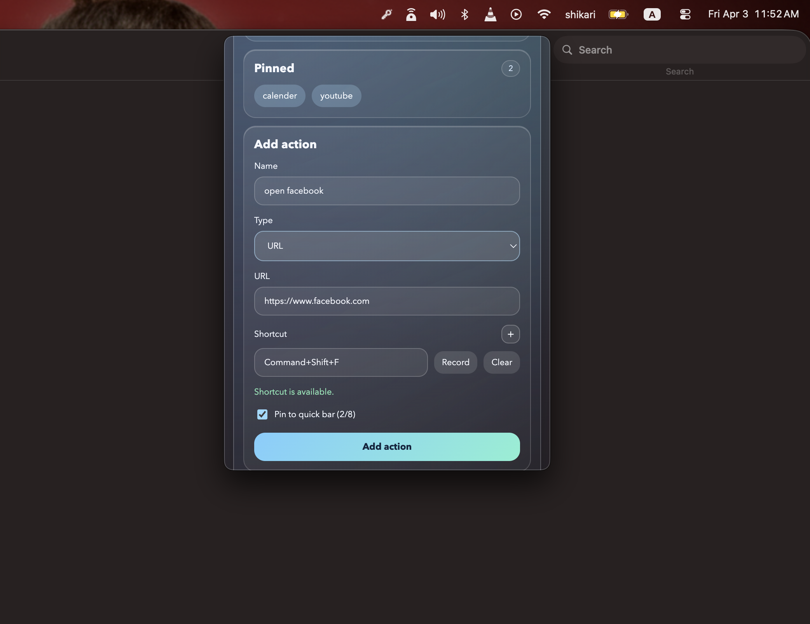
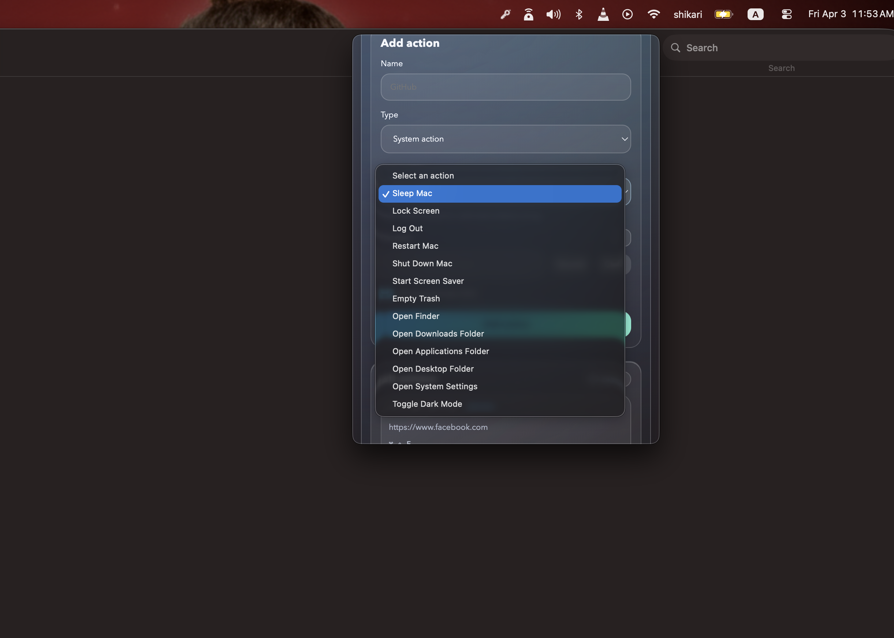

# Chabi

Glassy macOS menu bar launcher with global shortcuts, a floating quick bar, and safe action execution.

> Vibe coded with care.

## Why
Sohan needed a fast way to launch daily actions without breaking flow or opening full apps repeatedly.

## Quick Start
```bash
git clone https://github.com/ShikariSohan/chabi.git
cd chabi
npm install
npm run dev
```

## Download
- Latest release: [github.com/ShikariSohan/chabi/releases/latest](https://github.com/ShikariSohan/chabi/releases/latest)
- DMG (`v0.1.1`): [Chabi-0.1.1-arm64.dmg](https://github.com/ShikariSohan/chabi/releases/download/untagged-d7b4e7ac84741b5c3ba9/Chabi-0.1.1-arm64.dmg)
- ZIP (`v0.1.1`): [Chabi-0.1.1-arm64-mac.zip](https://github.com/ShikariSohan/chabi/releases/download/untagged-d7b4e7ac84741b5c3ba9/Chabi-0.1.1-arm64-mac.zip)

## What You Can Do
- Launch anything fast from the menu bar: websites, apps, shell commands, and system actions.
- Assign global shortcuts to actions and trigger them without opening the full app.
- Open the floating Quick Bar and run pinned actions with keyboard navigation.
- Record shortcuts with validation to avoid duplicate or unavailable key combos.
- Keep shell actions safer with first-run confirmation and risky action prompts.
- Import/export actions as JSON so setup is portable between machines.
- Track reliability with shortcut conflict checks and action health diagnostics.

## Screenshots
<p align="center">
  
  
</p>
<p align="center"><sub>Main command hub • Floating quick bar</sub></p>
<p align="center">
  
  
</p>
<p align="center"><sub>Add action flow • System action picker</sub></p>

## Core Scripts
- `npm run dev` - run Vite + Electron in dev
- `npm run build` - build renderer
- `npm run start` - run Electron app
- `npm run dist` - build local `.dmg` + `.zip` into `release/`
- `npm run release:ci` - CI release build + publish

## Docs
- [Features](docs/FEATURES.md)
- [Feature Ideas](docs/FEATURE-IDEAS.md)
- [Usage](docs/USAGE.md)
- [Architecture](docs/ARCHITECTURE.md)
- [Release Guide](docs/RELEASE.md)
- [Troubleshooting](docs/TROUBLESHOOTING.md)

## AI Context
Before making changes, read all markdown files inside [`ai-context/`](ai-context/).

Start with:
- [Rules](ai-context/00-RULES.md)
- [Project Context](ai-context/10-PROJECT-CONTEXT.md)
- [Release Context](ai-context/20-RELEASE-CONTEXT.md)

## License
Private project for now.
